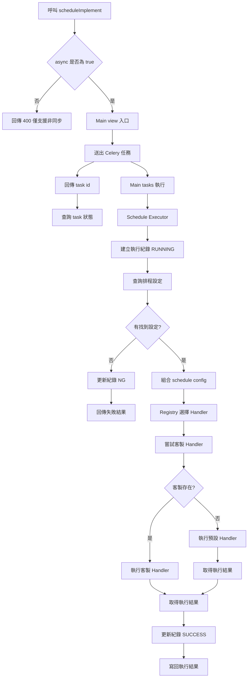
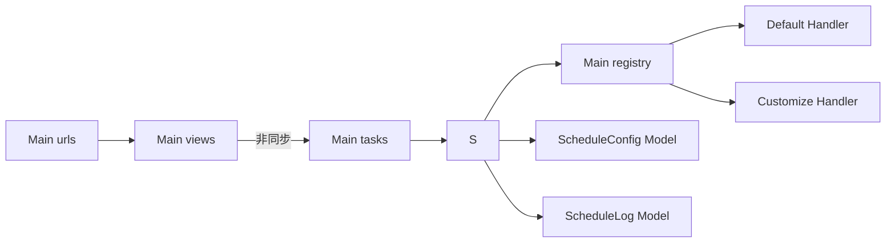

# Main 模組執行流程說明

## 1. 執行流程圖（僅非同步）



---

## 2. 檔案對應圖（職責分層）



---

## 3. 呼叫方式

1. 非同步執行
```http
GET /main/scheduleImplement?scheduleName=TestSchedule1&async=true
```
回傳 `task_id`，再查：
```http
GET /main/tasks/<task_id>
```

2. 若傳入 `async=false`（或非 `true`）
```http
GET /main/scheduleImplement?scheduleName=TestSchedule1&async=false
```
回傳 `400`，訊息為僅支援非同步。

---

## 4. 資料表用途

1. `tb_schedule_config`
- 存排程設定主檔（`schedule_name`、`schedule_mode`、`mapping_table`、`config_json`、`enabled`）

2. `tb_schedule_log`
- 存每次執行紀錄（`run_id`、`status`、`message`、`result_json`、時間欄位）

---

## 5. 後續擴充建議

1. 在 `Main/handlers/customize/` 依 `mapping_table` 放客製 Handler。  
2. 逐步把 `DEFAULT_HANDLER_BY_MODE` 從 `default` 換成真實流程 Handler。  
3. 若要定時執行，再加 `celery beat` 或 `django-celery-beat`。  
