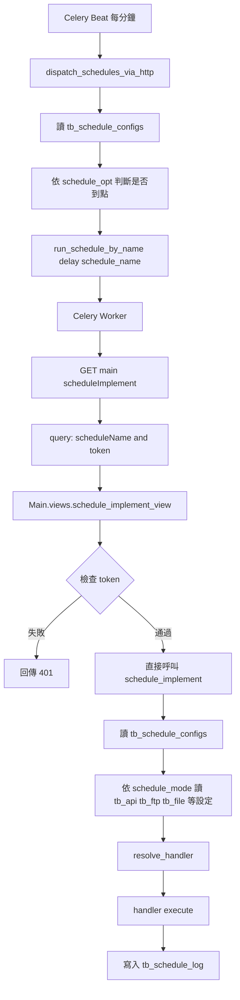
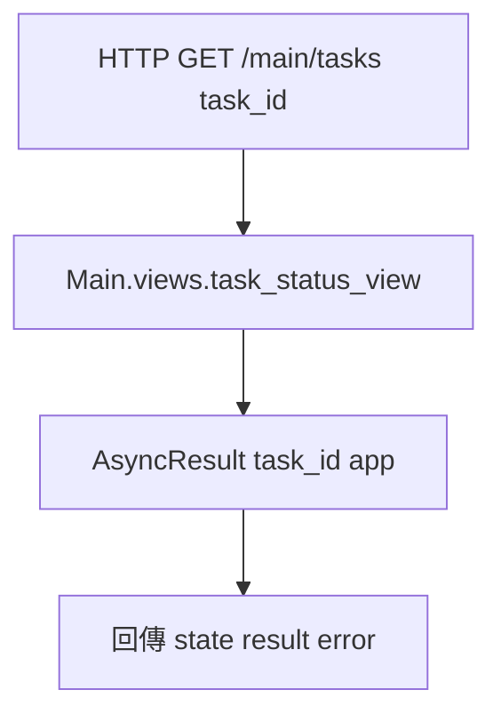

# Main APP Function 呼叫流程圖

## 1. Celery 定時觸發流程（HangFire 類似模式）

## 2. 查詢任務狀態

## 3. 檔案對應

- `Main/urls.py`
  - `scheduleImplement` -> `Main.views.schedule_implement_view`
  - `tasks/<task_id>` -> `Main.views.task_status_view`
- `Main/views.py`
  - 入口驗證 token；永遠直接執行 `schedule_implement`
- `Main/tasks.py`
  - `dispatch_schedules_via_http`：掃排程、到點建立 job
  - `run_schedule_by_name`：以 GET 呼叫 `/main/scheduleImplement`
- `Main/services/schedule_executor.py`
  - 核心流程：先讀 `tb_schedule_configs`，再依 `schedule_mode` 讀其他表、選 handler、寫 log
- `Share/Tool/schedule_fun.py`
  - 透過 DBTool 讀 `tb_*_configs` 外部設定表
- `Main/registry.py`
  - `schedule_mode` 與 handler 對應
- `Main/handlers/*`
  - 實際業務執行函式
